# pi_papers_2021_2

Projeto em flutter para o Trabalho 1 de Processamento de Imagens

## Execução do Projeto no GitHubPages

Para executar o projeto no GitHub Pages, basta acessar o [link](http://h80r.github.io/pi-papers-2021.2/).

## Instalação do Flutter

Acesse o [link](https://flutter.dev/docs/get-started/install) da página oficial do Flutter e escolha qual Sistema Operacional está utilizando.

### [Linux](https://flutter.dev/docs/get-started/install/linux)
Para instalar o Flutter no Linux, digite o comando `sudo snap install flutter --classic` no seu terminal.

Em seguida, execute `flutter doctor` para checar as dependências que precisam ser instaladas para concluir o setup.

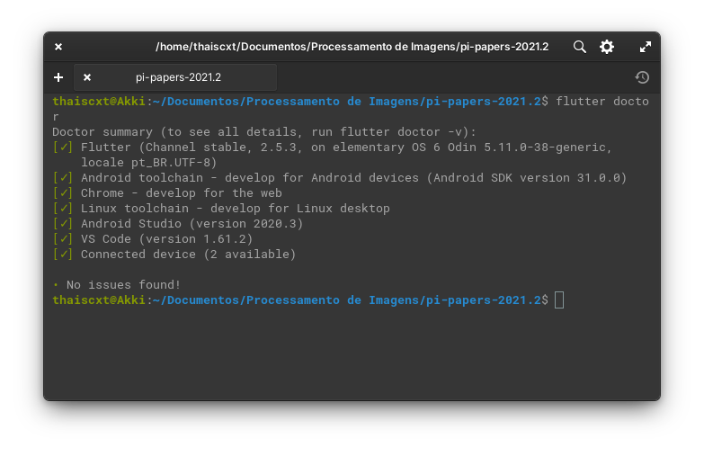

Segue link para instalação de algumas ferramentas que podem ser úteis:
- [Android Studio](https://developer.android.com/studio)
- [Google Chrome](https://www.google.com/chrome/?brand=BNSD&gclid=Cj0KCQiA4b2MBhD2ARIsAIrcB-QBGqBUZtzcFtjXo_kz6iHp1i0y2src0i9GD4MhVS4JS_zomG_z33gaAlWPEALw_wcB&gclsrc=aw.ds)
- [VSCode](https://code.visualstudio.com/download)

## Execução do Projeto

Na paǵina inicial do repositório no GitHub, clique no botão verde _Code_ e copie o endereço HTTPS para clonar o repositório na sua máquina local.

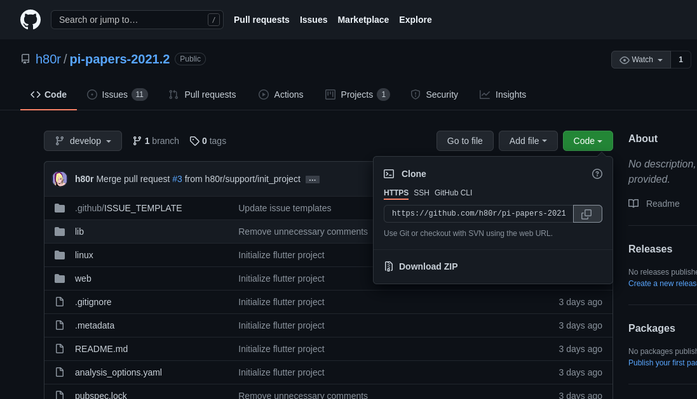

Com o endereço HTTPS copiado, abra seu terminal de preferência, vá para o diretório onde deseja baixar o projeto e digite o comando `git clone <endereço HTTPS copiado>` e aperte *enter*.

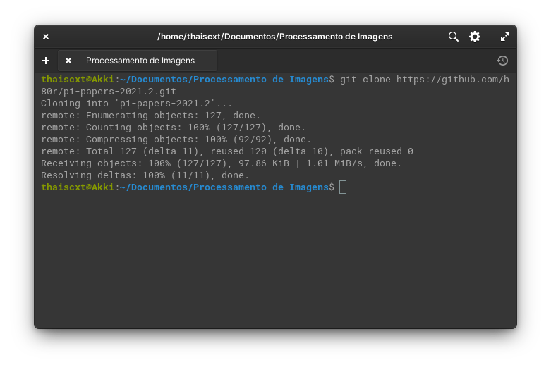

Para visualizar o código, abra seu editor de código de preferência na pasta *pi-papers-2021.2*.

Caso alguns pacotes estejam faltando ou estão desatualizados, execute o comando `flutter pub get` em seu terminal dentro da pasta *pi-papers-2021.2*.

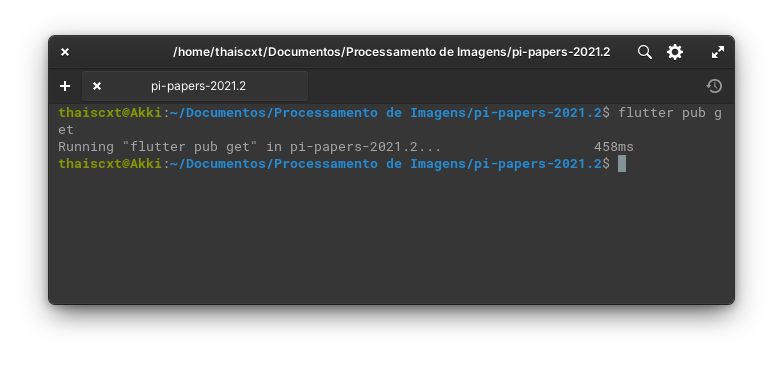

Para executar a aplicação, basta digitar o comanto `flutter run` em seu terminal ou utilizar o atalho `Crtl + F5`, caso esteja no VSCode.

## Interface

O projeto tem nome **Dr. Image** e sua interface pode ser visualizada nas seguintes imagens:

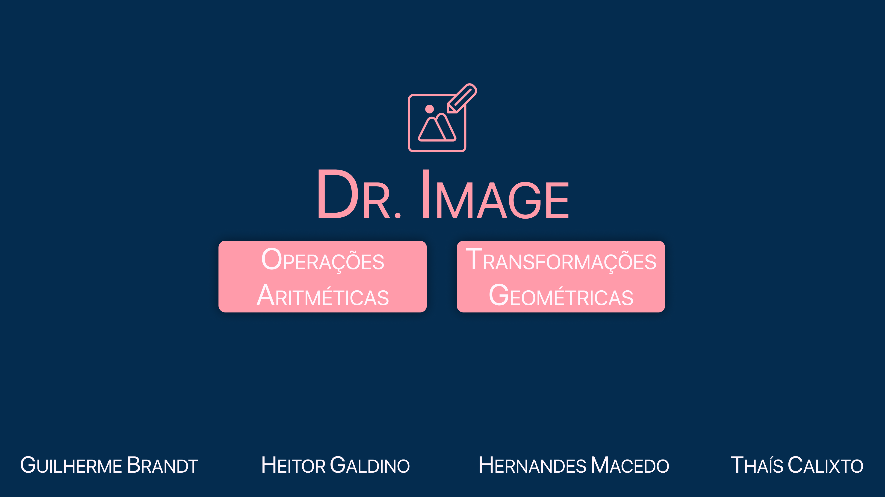
*Página Home*

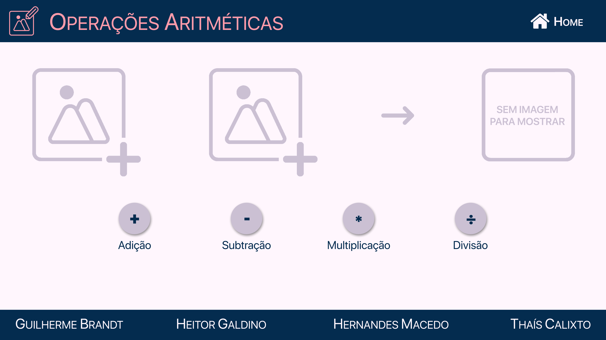
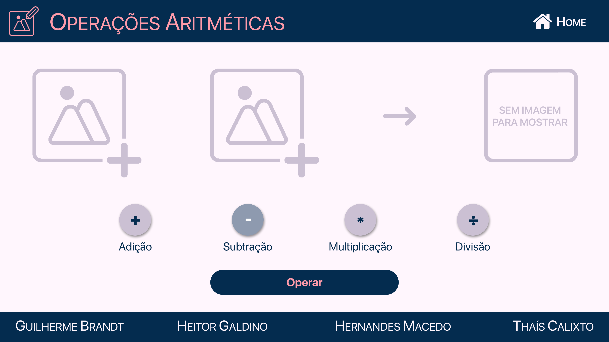
*Página de Operações Aritméticas*

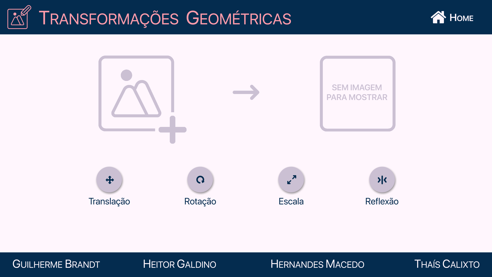
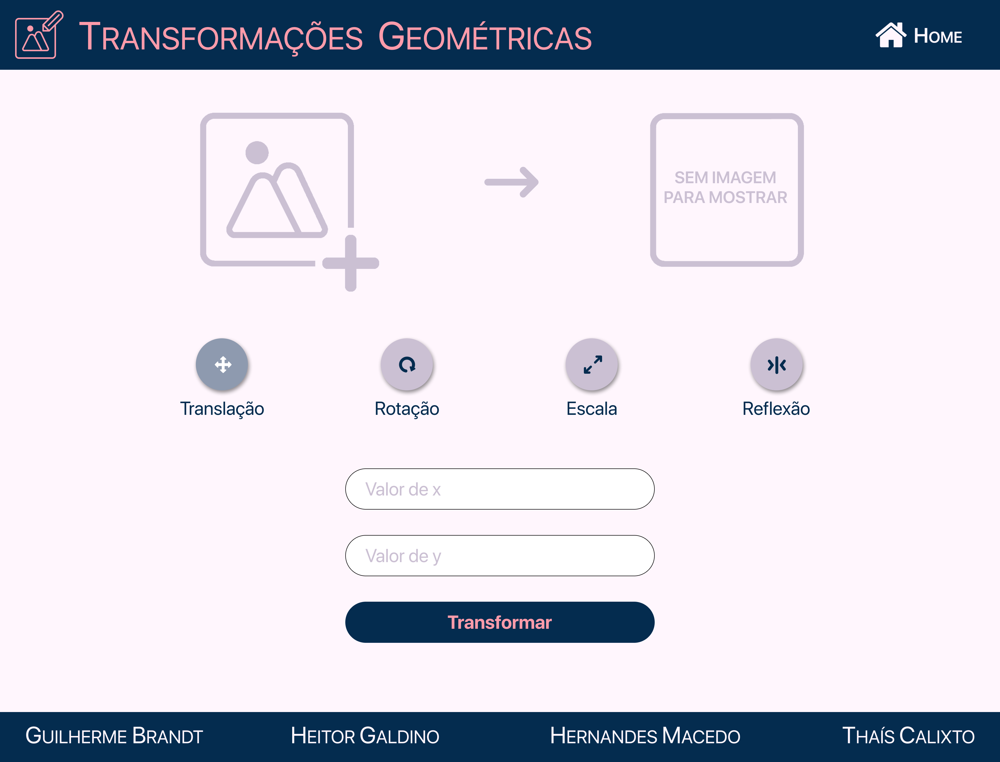
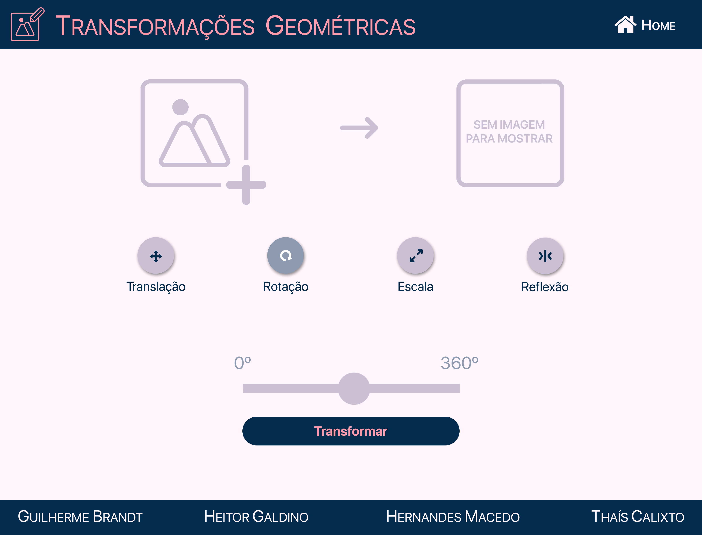
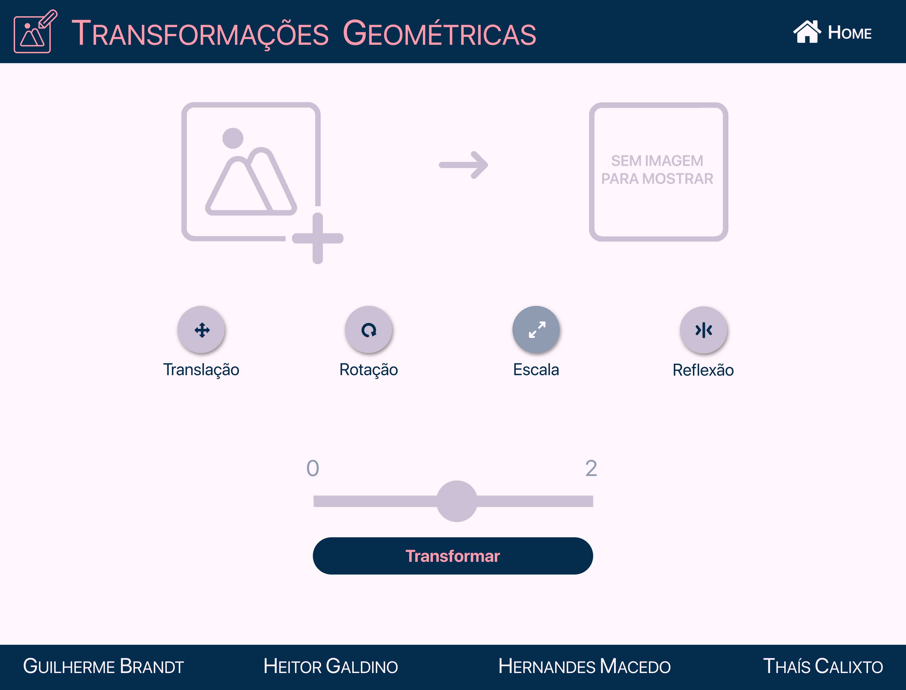
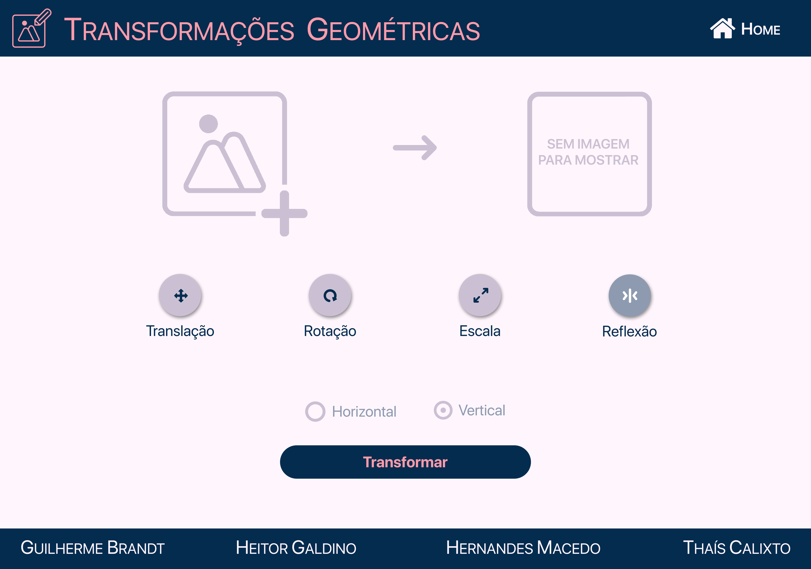
*Página de Transformações Geométricas*

Toda a interface é composta por cores da paleta oficial:
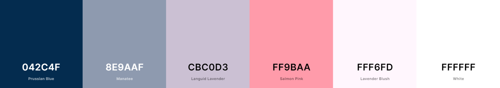
*Paleta de cores do projeto*

A fonte oficial utilizada é a *San Francisco Display by Apple*.